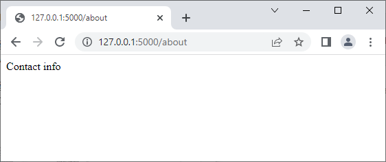
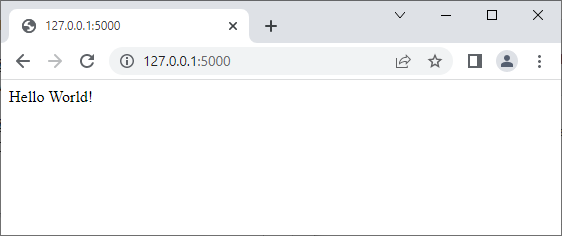

## Fisrt day with flask
- simple code

'''
from flask import Flask
app = Flask(__name__)

@app.route('/')
def index():
    return "Hello World!"

@app.route("/about")
def about():
    return "Contact info"

if __name__ == "__main__":
    app.run(debug=True)
'''

